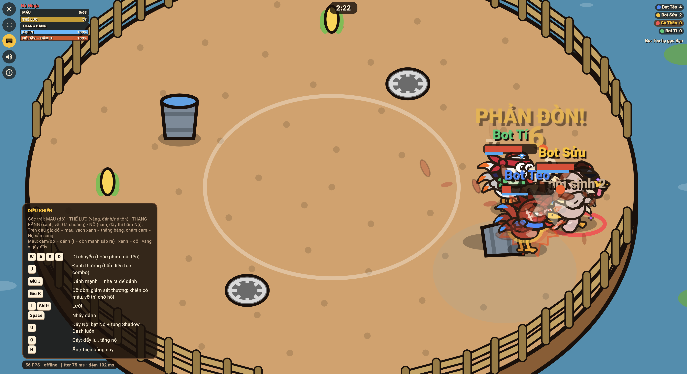
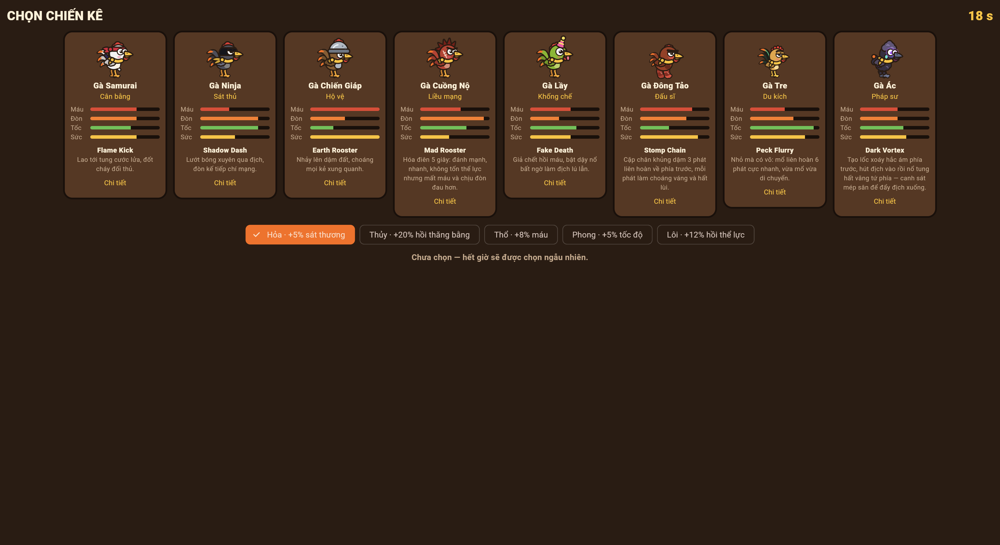
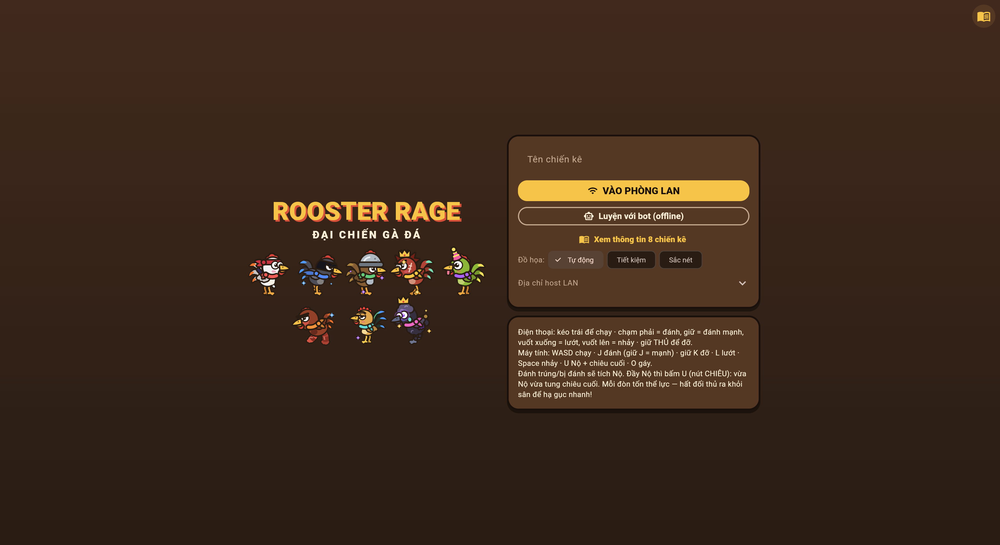
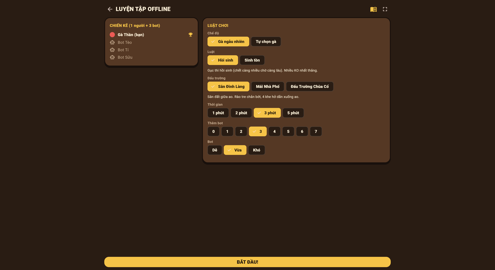

# 🐓 Rooster Rage (Đại Chiến Gà Đá)

> A chaotic, fast-paced party physics fighting game built with Flutter and Flame. Battle friends over local Wi-Fi (LAN) with zero install, or practice solo against AI bots.

---

## 🌟 Key Features

- **⚡ Zero-Install LAN Multiplayer**: Host on one computer, and friends on the same Wi-Fi network can jump in immediately by scanning a QR code with their phone browser (Flutter Web WASM).
- **🕹️ Authoritative Simulation**: Deterministic 2D physics, hitboxes, knockback, and combat logic run on an authoritative host with binary snapshot synchronization over WebSockets.
- **🎨 Procedural Vector Graphics**: Fighters are drawn procedurally using Flutter Canvas (`dart:ui`) instead of heavy sprite sheets, allowing dynamic feather colors, crests, spurs, and lightweight bundle sizes.
- **🔊 Synthesized Web Audio**: Dynamic, real-time procedural sound effects and retro chiptune battle music synthesized in code via the Web Audio API.
- **📱 Responsive Multi-Platform Controls**: Adaptive controls featuring on-screen touch virtual joysticks for mobile browsers and keyboard bindings for desktop.
- **🤖 Offline Solo Mode**: Practice offline against configurable AI bots with difficulty scaling.

---

## 📸 Gameplay Preview

| Arena Battle (In-Game Combat) | Character Selection (8 Unique Classes) |
| :---: | :---: |
|  |  |
| *Real-time physics-based rooster brawl with hitboxes & combat text* | *8 procedural rooster breeds with distinct playstyles & elemental buffs* |

| Main Menu | Match Lobby & Custom Rules |
| :---: | :---: |
|  |  |
| *Instant LAN join or practice offline against AI bots* | *Custom match rules: arenas, bot difficulty, respawn vs survival* |

---

## 🏗️ Project Architecture (Monorepo)

The repository is organized into three clean layers:

```
Rooster Rage/
├── packages/
│   └── rooster_core/    # Pure Dart simulation, physics, combat rules, AI & binary protocol
├── server/              # Shelf HTTP & WebSocket LAN host server (CLI)
├── app/                 # Flutter & Flame client game (Web, Mobile, Desktop)
└── scripts/
    └── run_lan.sh       # One-click script to build the web client and launch the LAN host
```

### 1. `packages/rooster_core` (Shared Game Core)
- **100% Pure Dart** (`no-flutter`, `no dart:io`).
- Runs in all environments: Web clients, servers, and mobile apps.
- Contains the authoritative simulation engine (`MatchSim`), physics, combat resolutions, skills, fighter state machines, bot AI (`BotBrain`), and the compact binary snapshot codec.

### 2. `server/` (LAN Host Server)
- Dart CLI server powered by **Shelf** and **shelf_web_socket**.
- Serves the Flutter Web production build over HTTP and manages real-time authoritative room sessions over WebSockets (`/ws`).
- Detects the local LAN IP address and prints a join URL alongside an ASCII QR code directly in your terminal.

### 3. `app/` (Presentation & Client Game)
- Built with **Flutter** and the **Flame Engine** (`flame`).
- Uses Flame for the rendering loop and entity layer management (`RoosterGame`, `ArenaRenderer`, `EntityLayer`, `EffectsLayer`).
- Uses Flutter widgets for navigation (`go_router`), state management (`flutter_riverpod`), menus, lobby, and touch controls (`InputController`).

---

## 🚀 Getting Started

### Prerequisites

- [Flutter SDK](https://docs.flutter.dev/get-started/install) (>= 3.29.0)
- [Dart SDK](https://dart.dev/get-dart) (>= 3.11.0)

---

### Quick Launch: Host a LAN Party

To build the client and start hosting a local multiplayer match:

```bash
./scripts/run_lan.sh
```

1. The script compiles the web client (`flutter build web --release --wasm`).
2. Starts the LAN server on port `8080`.
3. Displays the connection URL and a **QR Code** in your terminal.
4. Anyone on the same Wi-Fi can scan the QR code to join the lobby instantly from their phone's browser.

Options:
```bash
./scripts/run_lan.sh -p 9000          # Run on a custom port
SKIP_BUILD=1 ./scripts/run_lan.sh     # Skip web build if already built
```

---

### Running the Client Locally (Development Mode)

To run the Flutter client directly on your device or browser:

```bash
cd app
flutter pub get
flutter run -d chrome     # Run in Chrome
# or: flutter run -d macos / windows / android / ios
```

---

### Running the Server Standalone

```bash
cd server
dart pub get
dart run bin/server.dart --web ../app/build/web
```

---

## 🎮 How to Play

- **Movement**: Virtual Joystick (Mobile) or `W / A / S / D` / `Arrow Keys` (Desktop).
- **Light Attack / Peck**: `J` / Tap Attack Button.
- **Heavy Kick / Jump**: `K` / Tap Jump Button.
- **Special Skill**: `L` / Tap Skill Button when the rage bar fills up.
- **Block / Guard**: `Space` / Hold Guard Button.

---

## 🛠️ Tech Stack

| Component | Technology | Description |
| :--- | :--- | :--- |
| **Client Framework** | Flutter | Cross-platform UI, Canvas rendering, state management |
| **Game Engine** | Flame | Presentation layer, component hierarchy, game loop |
| **Game Core** | Pure Dart | Combat mechanics, deterministic physics, AI, binary codec |
| **Backend & WS** | Dart Shelf | LAN HTTP file server & authoritative WebSocket handler |
| **State Management** | Riverpod | Reactive UI state management |
| **Routing** | GoRouter | Declarative screen navigation |
| **Audio** | Web Audio Synth | Algorithmic procedural sound effects |

---

## 📄 License

This project is licensed under the MIT License - see the LICENSE file for details.
